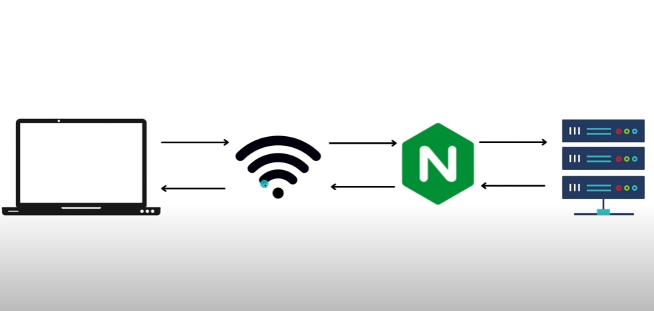

# NGINX Cheatsheet

## Overview
If a website is using NGINX to serve their web content, when you make a request to get the web content it will go through NGINX and NGINX will serve the web content by interacting with the website's servers rather than the website's servers providing the content themselves. 

This is known as a reverse proxy



### Benefits
* You can have as many servers in the backend and NGINX handles the load balancing, making scaling easier.  
* If you have multiple servers, NGINX will encrypt the data from them instead of each server needing to do the encryption themselves. 

## Install
### In Linux
Update Debian repository
```bash
sudo apt-get update
```
Install NGINX
```bash
sudo apt-get install nginx
```
Verify version
```bash
sudo nginx -v
```
### Post installation
After the install is complete a directory will be created in */usr/local/etc/nginx*. In this directory will be the *nginx.conf* file that will be used to configure NGINX as a reverse proxy. 

To start NGINX after the installation use the *nginx* command:
```bash
nginx
```

## Terminology
### Directives
Key value pairs
```nginx
my_directive    value;
```

### Context
Blocks that can contain other contexts or directives

```nginx
my_context {
    my_directive    value;
}
```

## Serving Content
To server an index.html file using NGINX on port 8080 use:
```nginx
http {
    server {
        listen  8080;
        root    /path/to/index;
    }
}

events {}
```
After any changes are made to the nginx.conf it can be reloaded so the changes take effect
```bash
nginx -s reload
```

## MIME Types
MIME types are how a browser recognizes file types over HTTP. They consist of a type and a subtype. Example "text/html" MIME type is the type "text" and subtype "html"

In NGINX these can be individually defined using
```nginx
http{
    types {
        text/css    css;
        text/html   html;
    }
}
```

ALternatively, the *mime.types* file in /usr/local/etc/nginx already has MIME types defined and can be included in a nginx.conf file
```nginx
http{
    include mime.types;
}
```


## Location Context
This context allows users to define different endpoint locations for a web app.

To serve the index.html file in a directory called *mydir* we would need to specify that like so: 
```nginx
http {
    server {
        listen  8080;
        root    /path/to/index;
    
        location /mydir {
            root    /path/to/index;
        }   
    }
}

events {}
```

Aliases for directories can also be created do directory names themselves are not used.

To create an alias called *myalias* for a directory called *mydir* simply use:
```nginx
http {
    server{
        listen  8080;
        root    /path/to/index;
    
        location /myalias {
            alias    /path/to/index/mydir;
        }
    }
}

events {}
```

If we want to serve a different file other than an index.html file such as *myindex.html*, we can use the *try_file* directive.

Here we define that we want to server the */mydir/myindex.html* file, if that fails then server the normal *index.html* file, and if that fails then return a 404 response:
```nginx
http {
    server{
        listen  8080;
        root    /path/to/index;
    
        location /mydir {
            root    /path/to/index;
            try_files /mydir/myindex.html /index.html =404; 
        }
    }
}

events {}
```

Lastly, location contexts can be used with regular expressions by using " ~\* ".

To specify a */count* folder with a 0-9 appended we can use regular expressions:

```nginx
http {
    server{
        listen  8080;
        root    /path/to/index;
    
        location ~* /count/[0-9] {
            root    /path/to/index;
        }
    }
}

events {}
```


## Rewrites and Redirects
### Redirects
To redirect a user to a different directory the location context can be used with the *return* keyword.

To redirect a user from */here* to */there* we can specify the 307 redirect HTTP code and use the *return* keyword:
```nginx
http {
    server {
        listen  8080;
        root    /path/to/index;
    
        location /here {
            return 307 /there;
        }
    }
}

events {}
```
### Rewrite
Rewrites will serve content to the user from a different directory than where they originally requested.

To define that if a user goes to */here* but will be served the content inside of */there*, we can use th the *rewrite* directive:
```nginx
http {
    server {
        listen  8080;
        root    /path/to/index;

        rewrite /here /there;
    }
}

events {}
``` 

## Load Balancing
To enable load balancing using NGINX we must define what kind of algorithm NGINX will be using to chose which servers to request content from. 

To specify that we want to use a Round Robin algorithm we can use the *upstream* context.

If we wanted to define that we want to do a round robin on four different localhost servers to serve the content at the root directory, we could specify something like this:

```nginx
http {
    upstream backendserver {
        server  127.0.0.1:1111;
        server  127.0.0.1:2222;
        server  127.0.0.1:3333;
        server  127.0.0.1:4444;
    }

    server {
        listen  8080;
        root    /path/to/index;

        location / {
            proxy_pass http://backendserver/;
        }
    }
}

events {}
```


